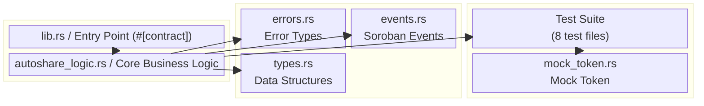
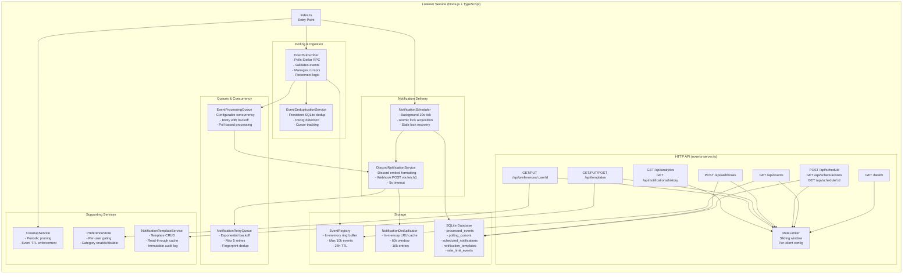
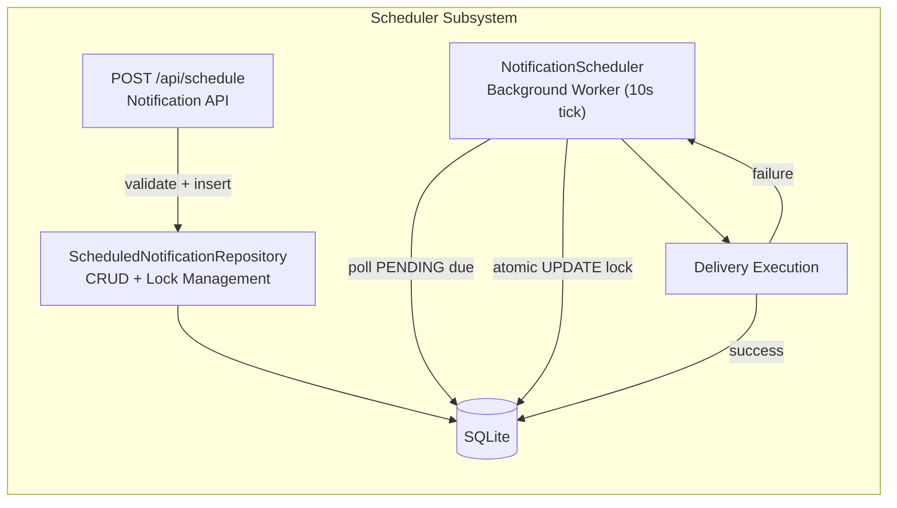
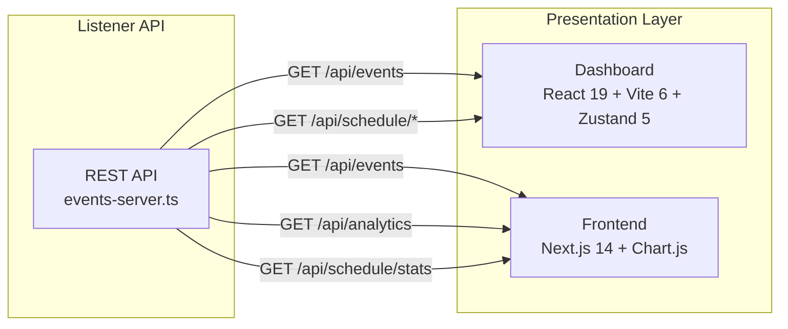
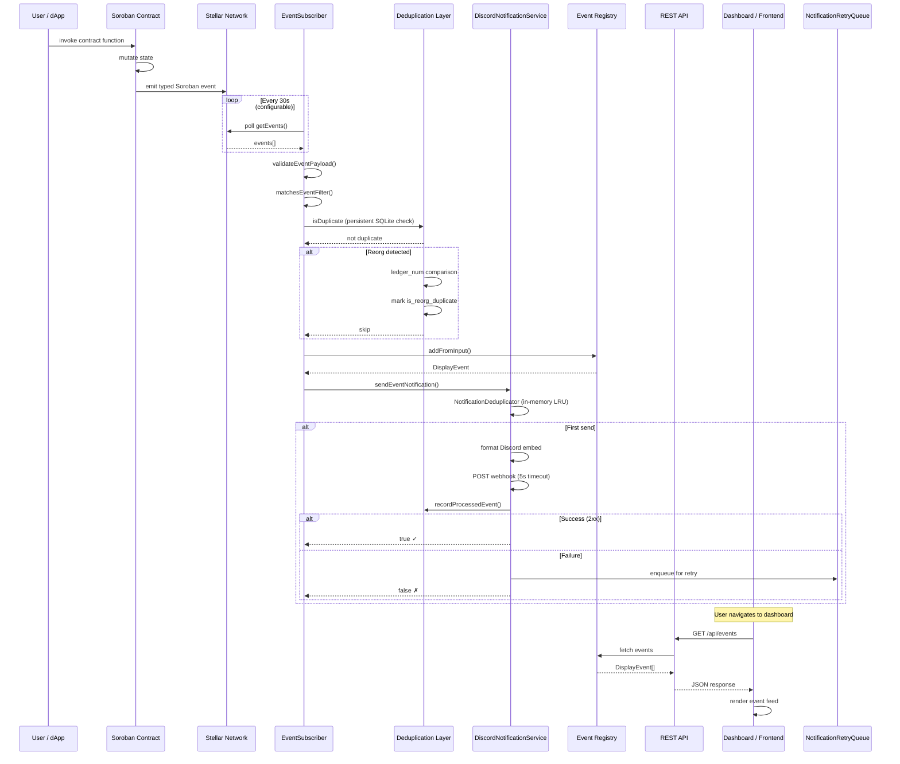
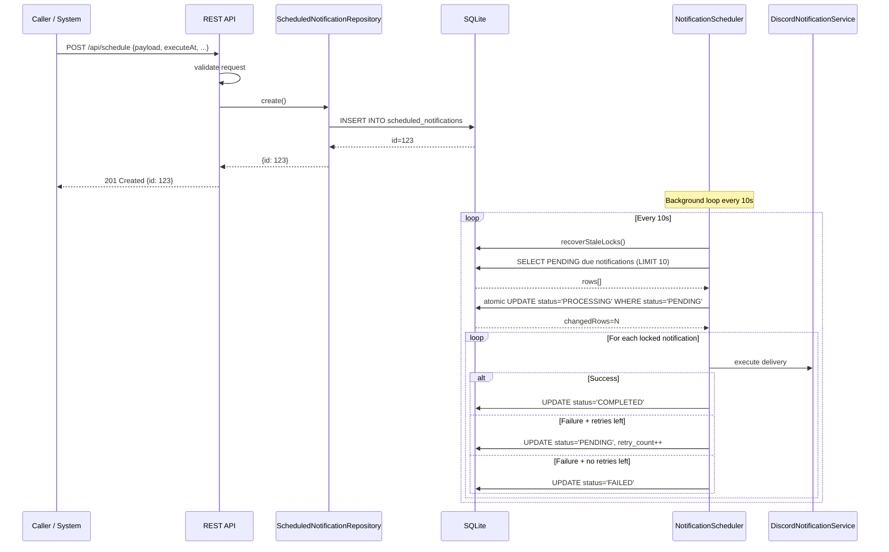
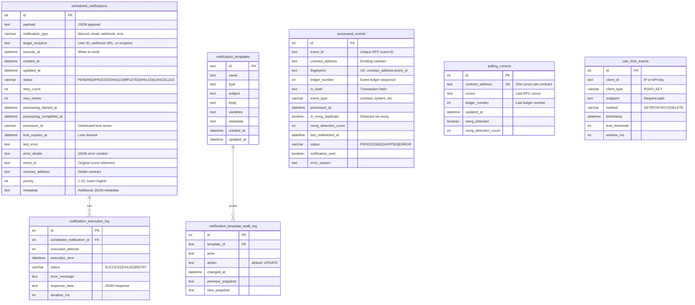
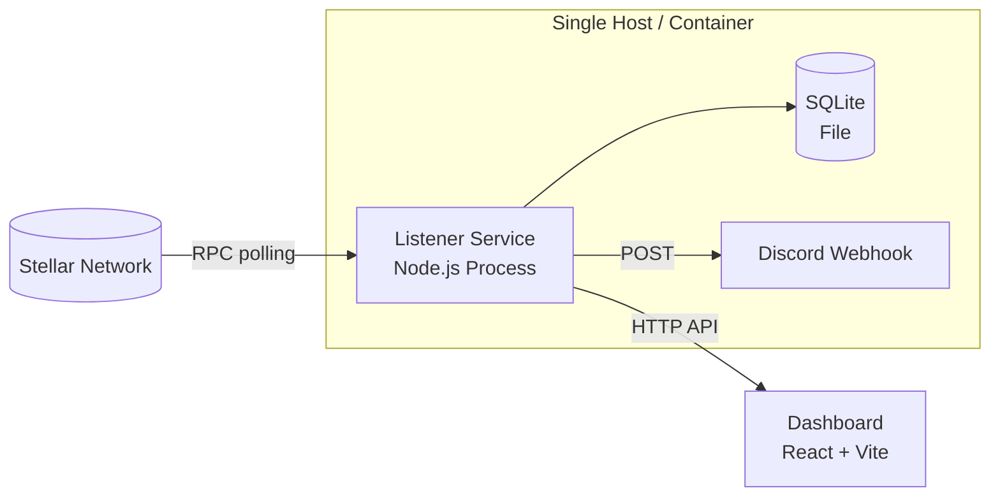
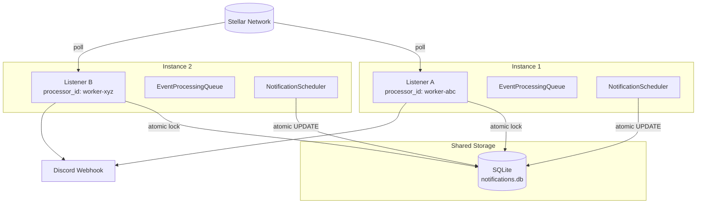

# NotifyChain — System Architecture

> **Audience**: Developers, integrators, and operators who need a visual
> and structured understanding of the NotifyChain system architecture,
> component interactions, and data flow.

## Table of Contents

1. [System Overview](#1-system-overview)
2. [High-Level Architecture](#2-high-level-architecture)
3. [On-Chain Layer — Smart Contracts](#3-on-chain-layer--smart-contracts)
4. [Off-Chain Layer — Listener Service](#4-off-chain-layer--listener-service)
5. [Presentation Layer — Dashboard & Frontend](#5-presentation-layer--dashboard--frontend)
6. [End-to-End Data Flow](#6-end-to-end-data-flow)
7. [Database Schema](#7-database-schema)
8. [Deployment Architecture](#8-deployment-architecture)
9. [Related Documentation](#9-related-documentation)

---

## 1. System Overview

NotifyChain is an **event monitoring and notification platform for Stellar
(Soroban) smart contracts**. It bridges on-chain contract activity to
off-chain consumers — Discord webhooks, REST API clients, and a React
dashboard — without requiring continuous RPC polling from every consumer.

The system is structured into three independent layers:

| Layer | Directory | Tech | Responsibility |
|-------|-----------|------|----------------|
| **Smart Contracts** | `contract/`, `Documents/Task Bounty/` | Soroban / Rust | Execute business logic and emit typed events per state change |
| **Listener Service** | `listener/` | Node.js / TypeScript | Poll Stellar RPC, deduplicate events, dispatch notifications, expose HTTP API |
| **Dashboard / Frontend** | `dashboard/`, `frontend/` | React + Vite, Next.js | Render event feed, analytics, and schedules for human operators |

---

## 2. High-Level Architecture

### Layer Responsibilities

- **On-Chain Layer**: The canonical source of truth. Contracts own state and
  emit one structured Soroban event per state transition.
- **Listener Service**: The core orchestration engine. Polls the Stellar
  network, deduplicates, dispatches notifications, and serves the HTTP API.
- **Presentation Layer**: Read-only consumers of the listener's API. Never
  talk to Stellar directly.

---

## 3. On-Chain Layer — Smart Contracts

### Contract Architecture

### Key Abstractions

| Concept | Location | Purpose |
|---------|----------|---------|
| `#[contract]` / `#[contractimpl]` | `lib.rs` | Soroban contract entry point macros |
| `#[contractevent]` | `base/events.rs` | Typed event definitions (12 event types) |
| `#[contracttype]` | `base/types.rs` | Storage data structures |
| `NotificationCategory` | `base/events.rs` | Event categorization: Group, Admin, Financial, Notification |
| `NotificationPriority` | `base/events.rs` | Priority levels: Low, Medium, High, Critical |
| `DataKey` | `base/types.rs` | Storage key enum for persistent state |

### Contracts Catalog

| Contract | Path | Purpose |
|----------|------|---------|
| **AutoShare** | `contract/contracts/hello-world/` | Subscription and group management. Group CRUD, member management, subscription payments, usage tracking. |
| **TaskBounty** | `Documents/Task Bounty/` | Decentralized task + reward board. Task lifecycle, submissions, disputes, payouts. |

---

## 4. Off-Chain Layer — Listener Service

### Internal Component Architecture

### Module Map

| Path | Role |
|------|------|
| `listener/src/index.ts` | Entry point. Wires subscriber, scheduler, server, and cleanup. |
| `listener/src/services/event-subscriber.ts` | Polls Stellar RPC, validates, deduplicates, processes events. |
| `listener/src/services/event-deduplication-service.ts` | Persistent dedup + reorg detection via SQLite. |
| `listener/src/services/discord-notification.ts` | Formats and delivers Discord webhook notifications. |
| `listener/src/services/event-processing-queue.ts` | Concurrency-controlled event processing with backoff. |
| `listener/src/services/notification-retry-queue.ts` | Exponential-backoff retry for failed notifications. |
| `listener/src/services/notification-deduplicator.ts` | In-memory LRU dedup (60s window). |
| `listener/src/services/notification-scheduler.ts` | Background scheduler for future-dated notifications. |
| `listener/src/services/notification-api.ts` | High-level scheduling API. |
| `listener/src/services/scheduled-notification-repository.ts` | SQLite CRUD for scheduled notifications. |
| `listener/src/services/notification-template-service.ts` | Template management with read-through cache. |
| `listener/src/services/webhook-verifier.ts` | HMAC signature verification for inbound webhooks. |
| `listener/src/services/cleanup-service.ts` | Periodic pruning of expired events and records. |
| `listener/src/services/notification-analytics-aggregator.ts` | Notification delivery analytics. |
| `listener/src/services/notification-history.ts` | Delivery history queries. |
| `listener/src/store/event-registry.ts` | In-memory event ring buffer. |
| `listener/src/store/preference-store.ts` | Per-user notification preference gating. |
| `listener/src/database/database.ts` | SQLite wrapper with migrations. |
| `listener/src/api/events-server.ts` | HTTP server (raw `http` module, no Express). |
| `listener/src/api/rate-limiter.ts` | Sliding window rate limiter. |
| `listener/src/config.ts` | Environment variable parsing and validation. |

### Scheduler Subsystem

The scheduler provides **at-least-once delivery** for future-dated notifications:

1. **Schedule**: Caller submits via `POST /api/schedule` → stored as `PENDING`
2. **Poll**: Background worker ticks every 10s, queries `WHERE status='PENDING' AND execute_at <= NOW()`
3. **Lock**: Atomic `UPDATE ... WHERE status='PENDING'` provides race-free distributed lock
4. **Execute**: Dispatches via configured channel (Discord, webhook, etc.)
5. **Complete**: Marks `COMPLETED` on success; retries or marks `FAILED` on failure

---

## 5. Presentation Layer — Dashboard & Frontend

| Component | Tech | Responsibility |
|-----------|------|----------------|
| **Dashboard** | React 19, Vite 6, Zustand 5 | Events feed, schedule viewer, stats. Read-only consumer. |
| **Frontend** | Next.js 14, Chart.js, Tailwind CSS | Analytics dashboard with visualization. Read-only consumer. |

---

## 6. End-to-End Data Flow

### Primary Flow: Event → Notification

### Secondary Flow: Scheduled Notifications

### Deduplication Safeguards

NotifyChain employs **two-layer deduplication**:

| Layer | Service | Storage | Window | Survival |
|-------|---------|---------|--------|----------|
| **Persistent** | `EventDeduplicationService` | SQLite `processed_events` | Permanent | Restarts + reorgs |
| **In-Memory** | `NotificationDeduplicator` | LRU cache (10k entries) | 60 seconds | Session only |

**Reorg Detection** works by comparing event ledger numbers:

1. Each polling cycle compares the first event's ledger with the stored cursor
2. If `new_ledger < last_known_ledger` → reorg detected
3. The event is marked as `is_reorg_duplicate` in SQLite
4. Notification is skipped (already sent during the original chain)

---

## 7. Database Schema

### Index Strategy

| Table | Index | Purpose |
|-------|-------|---------|
| `scheduled_notifications` | `status + execute_at` WHERE `status='PENDING'` | Scheduler polling query |
| `scheduled_notifications` | `lock_expires_at + status` WHERE `status='PROCESSING'` | Stale lock recovery |
| `processed_events` | `fingerprint` (UNIQUE) | Fast dedup lookup |
| `processed_events` | `contract_address + event_id` | Contract-scoped lookup |
| `processed_events` | `ledger_number + contract_address` | Reorg detection |
| `polling_cursors` | `contract_address` (UNIQUE) | Cursor retrieval |

---

## 8. Deployment Architecture

### Single Instance

### Multi-Instance (Horizontal Scaling)

Key points for multi-instance:
- SQLite handles concurrent writes via atomic `UPDATE ... WHERE status='PENDING'`
- Each instance has a unique `processor_id` for lock ownership
- Stale lock recovery ensures crashed workers don't block notifications
- Event processing uses independent `EventProcessingQueue` instances

### Configuration Surface

All configuration is via environment variables, parsed and validated in
`listener/src/config.ts`:

| Category | Key Variables |
|----------|--------------|
| **Stellar** | `STELLAR_NETWORK`, `STELLAR_RPC_URL`, `CONTRACT_ADDRESSES` (JSON) |
| **Polling** | `POLL_INTERVAL_MS` (default 30000), `MAX_RECONNECT_ATTEMPTS`, `RECONNECT_DELAY_MS` |
| **API Server** | `EVENTS_API_PORT` (default 8787), `EVENTS_API_CORS_ORIGIN` |
| **Discord** | `DISCORD_WEBHOOK_URL`, `DEDUP_WINDOW_MS`, `DEDUP_MAX_SIZE` |
| **Scheduler** | `SCHEDULER_ENABLED`, `SCHEDULER_POLL_INTERVAL_MS` (default 10000), `SCHEDULER_BATCH_SIZE` (default 10) |
| **Database** | `DATABASE_PATH` (default `./data/notifications.db`) |
| **Rate Limiting** | `RATE_LIMIT_ENABLED`, `RATE_LIMIT_WINDOW_MS`, `RATE_LIMIT_MAX_REQUESTS` |
| **Retry** | `RETRY_BASE_DELAY_MS` (default 5000), `RETRY_MAX_RETRIES` (default 5) |
| **Logging** | `LOG_LEVEL` (default `info`) |
| **Cleanup** | `CLEANUP_EVENT_RETENTION_MS`, `CLEANUP_INTERVAL_MS` |

---

## 9. Related Documentation

### Architecture Docs
- [`ARCHITECTURE_OVERVIEW.md`](ARCHITECTURE_OVERVIEW.md) — Contributor-facing architecture deep-dive
- [`listener/ARCHITECTURE-DIAGRAM.md`](listener/ARCHITECTURE-DIAGRAM.md) — Scheduler subsystem diagrams
- [`Documents/Task Bounty/ARCHITECTURE.md`](Documents/Task%20Bounty/ARCHITECTURE.md) — TaskBounty contract architecture

### Operational Docs
- [`NOTIFICATION_FAILURE_RECOVERY.md`](NOTIFICATION_FAILURE_RECOVERY.md) — Retry lifecycle and recovery
- [`REORG-DEDUPLICATION-MONITORING.md`](REORG-DEDUPLICATION-MONITORING.md) — Reorg detection and monitoring
- [`RATE-LIMITING-IMPLEMENTATION.md`](RATE-LIMITING-IMPLEMENTATION.md) — Rate limiter design
- [`SCHEDULED-NOTIFICATIONS-DELIVERY.md`](SCHEDULED-NOTIFICATIONS-DELIVERY.md) — Delivery semantics
- [`TROUBLESHOOTING.md`](TROUBLESHOOTING.md) — Common failure modes

### Reference
- [`listener/API.md`](listener/API.md) — Full REST API specification
- [`NOTIFICATION_PAYLOAD_SCHEMA.md`](NOTIFICATION_PAYLOAD_SCHEMA.md) — Event payload schema
- [`contract/README.md`](contract/README.md) — AutoShare contract ABI reference

---

*Last updated: 2026-06-24. Maintained as part of issue #97.*
